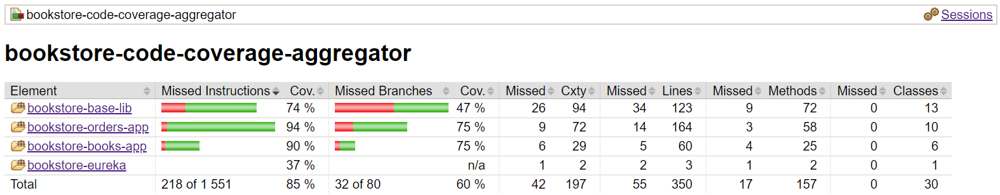

# bookstore
This repository contains a little microservice showcase.

Normally I would have asked what split of features between the different microservices is asked for, but in the spirit of speeding things up I simply made the following assumptions:
- There is one microservice (`bookstore-books-app`) that offers information on books
- There is one microservice (`bookstore-orders-app`) that offers CRUD operations for orders
- The only current interaction is as follows: The bookstore-orders-app only allows creating orders containing books that exist. For this the bookstore-orders-app calls the bokstore-books-app.

Beyond those two core apps, there also is `bookstore-eureka` (to fulfil the non functional requirement of service discovery).

## Technical Details
Spring Boot 2.2.0 is used. The microservices are maven projects embedded in a maven reactor (parent) project.
The build worked on my machine with maven 3.6.2 and a Java 13 SDK installed.
It should also work with Java 11, as 11 is set in the parent pom.

As a database, an in memory H2 database is used in both microservices.
In production one would probably use a database like Postgres.

The databases are provisioned with liquibase.
Each project contains a `resources/db/changelog-prod-xml` file, meant to set up the schema.
Additionally, a `resources/db/changelog-dev-xml` file exists, meant to be used when running locally and for testing to usable data to the database.

The project can be tested and built by running `mvn clean install`.
To speed up the build one can run `mvn clean install -T 1C` (One maven thread per core).

This project uses an .editorconfig file to enforce formatting for multiple developers and environments.
You might need to install plugins or enable editorconfig support in your development environment.

## Modules
### bookstore-base-lib
Contains some code used by both microservices.
Would also be used if new microservices were to be introduced.

### bookstore-books-app
Contains a Spring Boot microservice that offers information on books.

### bookstore-code-coverage-aggregator
Allows aggregated code coverage for all tests run via the reactor/parent project. See Tests chapter in this README.

### bookstore-eureka
Eureka Server embedded into a Spring Boot app.
Simply offers Eureka Server capabilities to allow service discovery capabilities.

### bookstore-orders-app
Contains a Spring Boot microservice that offers CRUD functionality for Order resources.

Orders consist of OrderItems. Orders can be updated.

## Authentication & Authorization
Auth0 is used as OAuth2 provider.
Auth0 was used because [Spring Security OAuth](https://spring.io/blog/2019/11/14/spring-security-oauth-2-0-roadmap-update) with its @EnableAuthorizationServer is considered deprecated.

All service calls require proper authentication & authorization.
For this, a JWT axquired from Auth0 needs to be provided in the Authorization header.
You can get a fresh token by using the call provided in the Postman collection.

Please use the `Auth0 Login` request and use the returned `access_token`.
Put it in the Authorization header, but do not forget to prefix it with `Bearer ` (Bearer + 1 space).
You can put it in your Postman Globals Authorization env var.

All necessary secrets will be supplied via mail.
If you have any troubled authenticating, please contact me.

Three different scopes are used: `read:books`, `write:orders`, `read:orders`.

Two users will be provided: One having all previously named scopes and one having none.

## Usage
To run the applications, you need to run `mvn spring-boot:run -Dspring-boot.run.profiles=local` for all three applications (eureka, books, orders).
You can also run the applications from your IDE, but make sure you use the `local` profile.
Since eureka service discovery is used, eureka must be running to allow interaction between services.

- `bookstore-books-app` uses port 8001
- `bookstore-eureka` uses port 8000
- `bookstore-orders-app` uses port 8002

Given more time and for a real world application, I would have implemented docker and docker-compose.

To play with the application, I have provided a Postman collection to call all possible endpoints.
As requested, there are a few (3) books hardcoded:

| Title  | ISBN | UUID |
| --- | --- |--- |
| Harry Potter und der Stein der Weisen (Harry Potter 1) | 9783551557414 | 9a020cba-3786-429f-8843-2723a57a8b8a |
| Harry Potter und die Kammer des Schreckens | 9783551354020 | b22498f5-c3de-410f-9d61-5ccf9c30f18b |
| Das inoffizielle Harry-Potter-Buch der Zauberei | 9783742301901 | 3ff8c6b0-27e7-4c80-8e72-903ecec6e8e1 |

## Testing
The majority of testing happens through Spring Integration tests that create the whole application context.
This kind of testing is the most realistic, self contained kind of testing possible for a Spring application.

Given more time and for a real world application, I would have added an application spanning test module that would have used something like Cucumber to test if the running applications properly interact with each other.

After running `mvn clean verify -T 1C`, the `bookstore-code-coverage-aggregator` project contains an aggregated code coverage report at `bookstore-code-coverage-aggregator/target/site/jacoco-aggregate/index.html`.
The aggregated code coverage report looks as follows:

## Limitations
Since I have given myself a strict time limit on how much time I want to spend on this exercise, there are several points I did differently than from what I would do in a real production ready application.
- I would have used some kind of service gateway like Zuul to provide a single point of entrance for external calls.
- I would have used Docker and docker-compose. This also makes running locally easier for everyone new to the project.
- I would not have used Eureka, but Kubernetes. Kubernetes inherently makes service discovery unnecessary and abstracts away the same application running multiple times.
- I would have written some kind of real integration test spanning the applications. For example with cucumber. (In an extra module like `bookstore-bdd-tests`)
- I would have used a real database, not H2
- To allow more self contained testing without external dependencies (e.g. for the not existing spanning integration test), an embedded oauth2 solution via Docker could have been considered.
- Hystrix settings would need to be tuned in regards to the expected call volume and error percentage
- Implement a call to check for the existence of books, instead of having one call per book.
- Implement Swagger. + Swagger docs
- More documentation: In this case, most things are pretty self explanatory, but normally you would want more documentation.

## Addressing the non functional requirements
### Authentication/Authorization
spring-security oauth2 is used, together with Auth0. Auth0 was used because [Spring Security OAuth](https://spring.io/blog/2019/11/14/spring-security-oauth-2-0-roadmap-update) with its @EnableAuthorizationServer is considered deprecated.
### Event logging
Given more time I would have asked what exactly is meant with this.
I simply implemented log calls for all controller methods.
### Distributed tracing
Spring Cloud Sleuth is used. You can see in the logs how the span id is propagated between the order service and the book service.
### Service discovery
Eureka is used.
### Resilience/ Failure cascading mitigations
For the one call between applications that happens, Hystrix is used.
